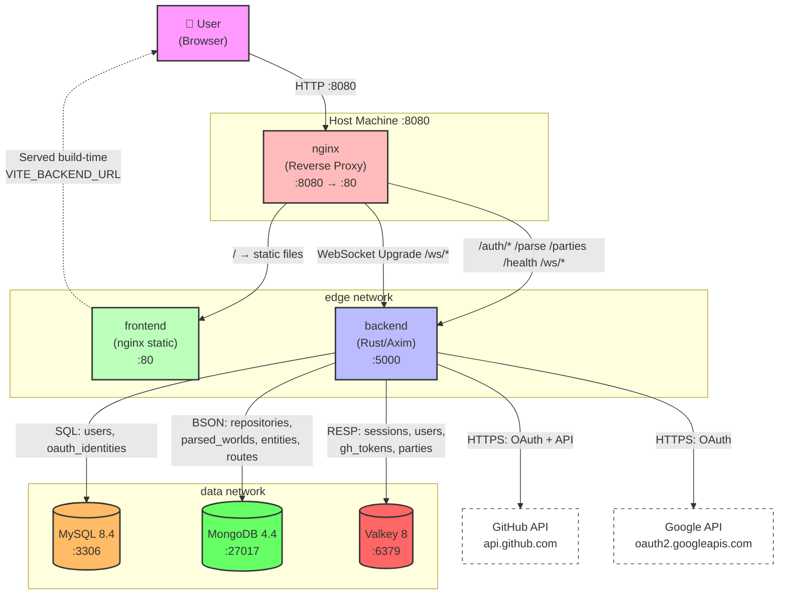
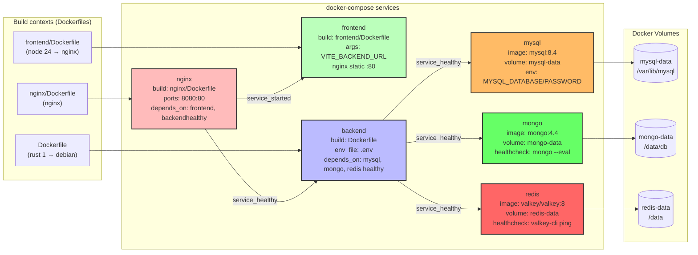
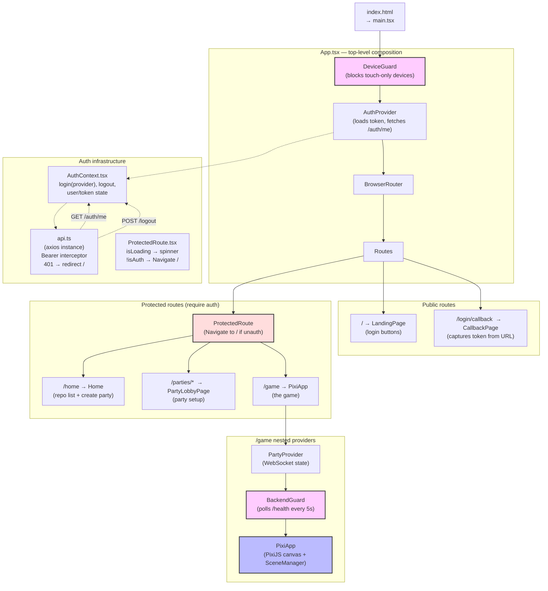
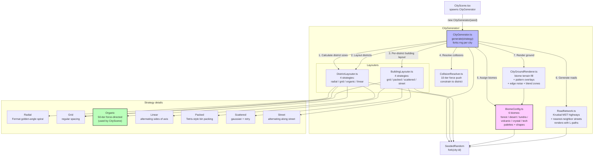
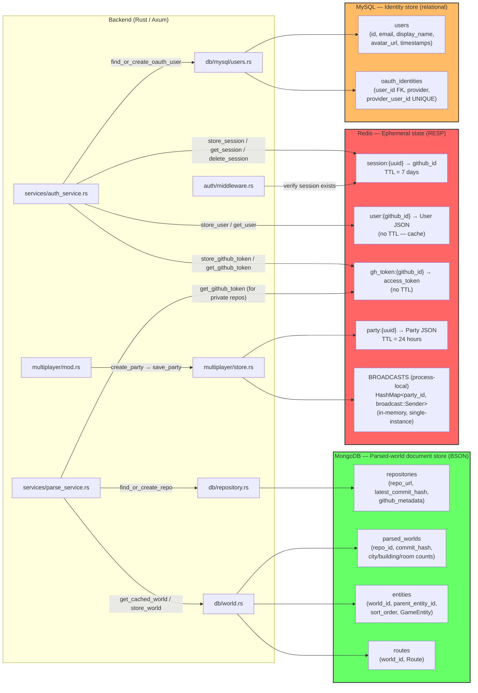
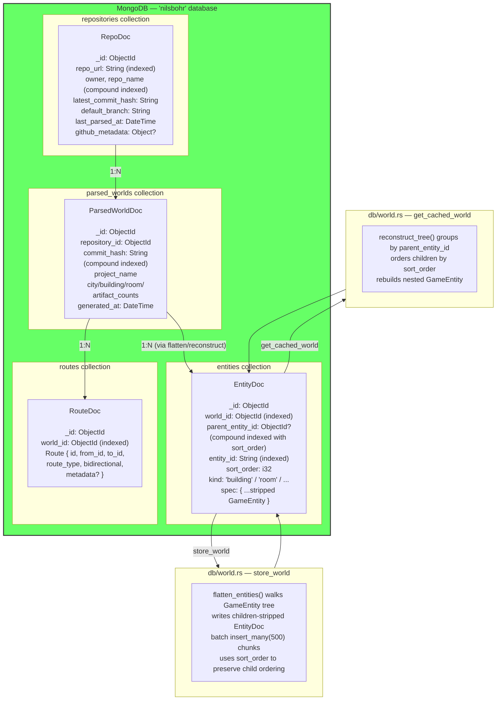
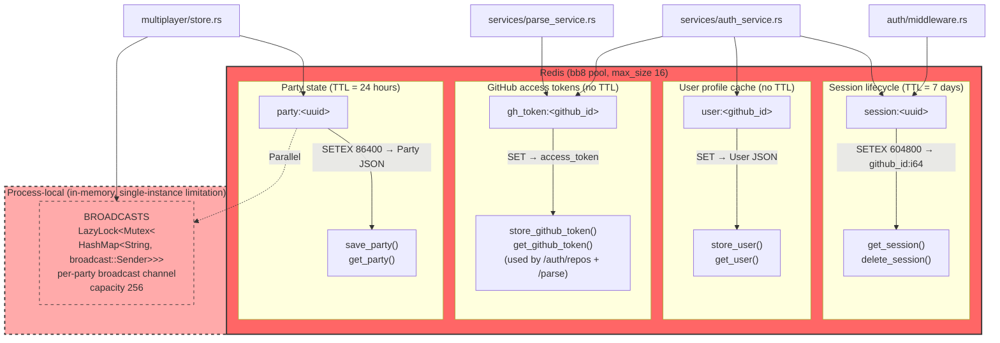
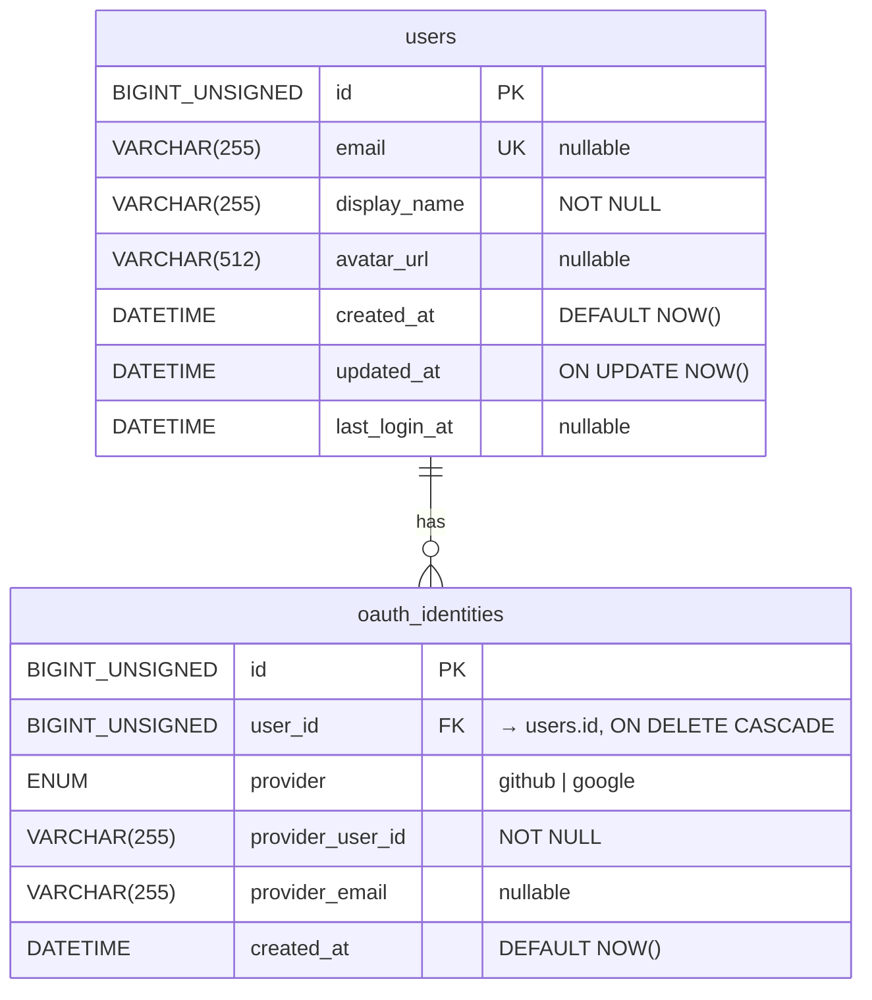

# NilsBohr — Architecture Diagrams

Detailed mermaid diagrams showing the full system architecture, container interactions, database responsibilities, and module organization.

---

## Table of Contents

1. [System Deployment Overview](#1-system-deployment-overview)
2. [Container Network Topology](#2-container-network-topology)
3. [Backend Module Architecture](#3-backend-module-architecture)
4. [Frontend Application Architecture](#4-frontend-application-architecture)
5. [Game Engine Architecture](#5-game-engine-architecture)
6. [City Generator Subsystem](#6-city-generator-subsystem)
7. [Database Responsibility Map](#7-database-responsibility-map)
8. [MongoDB Document Collections](#8-mongodb-document-collections)
9. [Redis Key Layout](#9-redis-key-layout)
10. [MySQL Schema](#10-mysql-schema)

---

## 1. System Deployment Overview

The entire stack runs in Docker Compose. Six containers across two networks (`edge` for user-facing traffic, `data` for internal DB access). Only the nginx container publishes a port (`8080`) to the host — all other containers are reachable only within the Docker network.



### Key points
- **nginx** is the single ingress point. It routes `/auth/*`, `/parse`, `/parties`, `/health`, and `/ws/*` to the backend, and everything else (`/`) to the static frontend.
- The **backend** is on both networks: `edge` (to receive proxied requests from nginx) and `data` (to reach MySQL, MongoDB, Redis).
- The three databases are on the `data` network only — not exposed to the host.
- The backend also makes outbound HTTPS calls to GitHub and Google for OAuth and repository metadata.

---

## 2. Container Network Topology

A closer look at the Docker Compose services, their build contexts, health checks, and dependency graph.



### Service details

| Service | Image / Build | Port | Health Check | Restart Policy |
|---|---|---|---|---|
| `nginx` | `nginx/Dockerfile` → `nginx:stable` | `8080:80` | (none — depends on backend) | `unless-stopped` |
| `frontend` | `frontend/Dockerfile` → multi-stage `node24` → `nginx` | `80` (internal) | (none) | `unless-stopped` |
| `backend` | `Dockerfile` → multi-stage `rust1` → `debian-slim` | `5000` (internal) | `curl -f http://localhost:5000/health` | `unless-stopped` |
| `mysql` | `mysql:8.4` | `3306` (internal) | `mysqladmin ping -h localhost` | `unless-stopped` |
| `mongo` | `mongo:4.4` | `27017` (internal) | `mongo --eval db.adminCommand('ping')` | `unless-stopped` |
| `redis` | `valkey/valkey:8` | `6379` (internal) | `valkey-cli ping` | `unless-stopped` |

---

## 3. Backend Module Architecture

The Rust backend is organized into 14 top-level modules under `backend/src/`. This diagram shows the dependency graph (which module imports which) and the flow of data through the system.

```mermaid
graph TB
    subgraph Entry["Entry point"]
        Main["main.rs<br/>#[tokio::main]<br/>builds AppState → build_app"]
        Lib["lib.rs<br/>build_app → Router<br/>CORS layer, routes"]
    end

    subgraph State["State & Config"]
        AppState["state.rs<br/>AppState {config, redis, http, db, mysql}"]
        AuthConfig["auth/config.rs<br/>AuthConfig::from_env"]
    end

    subgraph Auth["auth/ — OAuth, JWT, sessions"]
        AuthMod["auth/mod.rs"]
        JWT["auth/jwt.rs<br/>create_token / verify_token"]
        MW["auth/middleware.rs<br/>AuthUser extractor<br/>(Bearer + cookie)"]
        RedisAuth["auth/redis.rs<br/>bb8 pool<br/>user/session/gh_token keys<br/>TTL = 7d"]
        Github["auth/oauth/github.rs<br/>build_authorize_url<br/>exchange_code<br/>fetch_github_user"]
        Google["auth/oauth/google.rs<br/>build_google_authorize_url<br/>exchange_google_code<br/>fetch_google_user"]
        AuthRoutes["auth/routes/<br/>login, callback, google_*,<br/>logout, me, repos"]
        AuthModels["auth/models.rs<br/>User, AuthUser, Claims,<br/>GitHubUser, GoogleUser"]
    end

    subgraph DB["db/ — Persistence"]
        DBMod["db/mod.rs<br/>MongoDB init + indexes"]
        ModelsDB["db/models.rs<br/>RepoDoc, ParsedWorldDoc,<br/>EntityDoc, RouteDoc"]
        RepoDB["db/repository.rs<br/>find_or_create_repo<br/>update_repo_after_parse"]
        WorldDB["db/world.rs<br/>get_cached_world<br/>store_world"]
        MySQLMod["db/mysql/mod.rs<br/>pool + migrate"]
        UsersDB["db/mysql/users.rs<br/>find_or_create_oauth_user"]
        MySQLModels["db/mysql/models.rs<br/>UserRow, OAuthIdentityRow"]
    end

    subgraph Parser["Parser pipeline"]
        ParserMod["parser.rs<br/>generate_world (orchestrator)"]
        Walker["walker.rs<br/>collect_file_paths"]
        Hierarchy["hierarchy.rs<br/>reconstruct_hierarchy<br/>(files → districts)"]
        SymTab["symbol_table.rs<br/>index_cities / resolve"]
        GitLayer["git_layer.rs<br/>shallow_clone + tip metadata"]
    end

    subgraph Langs["languages/ — tree-sitter parsers"]
        Registry["languages/registry.rs<br/>parse_by_extension"]
        Parsers["Parsers:<br/>rs, ts, js, py,<br/>cpp, c, java"]
        ParserUtils["languages/parser_utils.rs"]
    end

    subgraph Domain["domain/"]
        EntityTree["entity_tree.rs<br/>flatten / reconstruct<br/>(MongoDB round-trip)"]
    end

    subgraph Multi["multiplayer/"]
        MultiMod["multiplayer/<br/>create_party, get_party,<br/>ws_handler"]
        Party["party.rs<br/>add_member / remove_member"]
        Store["store.rs<br/>Redis keys +<br/>broadcast channels"]
        Messages["messages.rs<br/>PartyMessage enum"]
    end

    subgraph Services["services/ — orchestration"]
        AuthSvc["services/auth_service.rs<br/>handle_callback, issue_session,<br/>list_user_repos"]
        GithubSvc["services/github_service.rs<br/>fetch_repo_metadata,<br/>fetch_latest_commit_hash,<br/>fetch_user_repos"]
        ParseSvc["services/parse_service.rs<br/>parse_repository orchestrator"]
    end

    subgraph Routes["routes/"]
        RoutesMod["routes.rs<br/>parse_repo_handler"]
    end

    subgraph Models["models.rs"]
        GameModels["GameEntity (City/District/<br/>Building/Room/Artifact),<br/>WorldSeed, Route"]
    end

    subgraph Errors["error.rs"]
        AppError["AppError enum<br/>NotFound, Unauthorized,<br/>Database, Sqlx, Git, ..."]
    end

    %% Core connections
    Main --> AppState
    Main --> Lib
    Lib --> AuthRoutes
    Lib --> RoutesMod
    Lib --> MultiMod
    Lib --> AuthConfig
    Lib --> AppState

    %% State
    AppState --> AuthConfig
    AppState --> RedisAuth
    AppState --> DBMod
    AppState --> MySQLMod

    %% Auth flow
    AuthRoutes --> AuthSvc
    AuthSvc --> Github
    AuthSvc --> Google
    AuthSvc --> UsersDB
    AuthSvc --> RedisAuth
    AuthSvc --> JWT
    AuthSvc --> AuthModels
    MW --> JWT
    MW --> RedisAuth

    %% Parse flow
    RoutesMod --> ParseSvc
    ParseSvc --> GithubSvc
    ParseSvc --> RepoDB
    ParseSvc --> WorldDB
    ParseSvc --> GitLayer
    ParseSvc --> ParserMod

    ParserMod --> Walker
    ParserMod --> Hierarchy
    ParserMod --> SymTab
    ParserMod --> Registry
    ParserMod --> GameModels

    Registry --> Parsers
    Parsers --> ParserUtils
    Parsers --> GameModels

    WorldDB --> EntityTree
    WorldDB --> ModelsDB
    RepoDB --> ModelsDB

    %% Multiplayer
    MultiMod --> Party
    MultiMod --> Store
    MultiMod --> Messages
    Store --> RedisAuth

    %% Errors everywhere
    AppError -.->|"From&lt;mongodb::Error&gt;"| DBMod
    AppError -.->|"From&lt;sqlx::Error&gt;"| UsersDB
    AppError -.->|"map_err"| AuthSvc
    AppError -.->|"map_err"| ParseSvc

    %% GitHub external
    Github -->|"HTTPS"| ExtGH["GitHub API"]
    GithubSvc -->|"HTTPS"| ExtGH
    Google -->|"HTTPS"| ExtGG["Google API"]

    style Main fill:#bbf,stroke:#333,stroke-width:2px
    style Lib fill:#bbf,stroke:#333,stroke-width:2px
    style AppState fill:#fdd,stroke:#333,stroke-width:2px
    style ParseSvc fill:#dfd,stroke:#333,stroke-width:2px
    style AuthSvc fill:#dfd,stroke:#333,stroke-width:2px
    style AppError fill:#fbb,stroke:#333,stroke-width:2px
    style ExtGH fill:#fff,stroke:#333,stroke-dasharray: 5 5
    style ExtGG fill:#fff,stroke:#333,stroke-dasharray: 5 5
```



### Module responsibilities at a glance

| Module | Key files | Responsibility |
|---|---|---|
| `auth` | `oauth/`, `routes/`, `jwt.rs`, `middleware.rs`, `redis.rs` | GitHub + Google OAuth, JWT issuance/verification, session management, `AuthUser` extractor |
| `db` | `mod.rs`, `repository.rs`, `world.rs`, `mysql/` | MongoDB connection + indexes, repo world cache, MySQL user persistence |
| `domain` | `entity_tree.rs` | Flatten/reconstruct GameEntity tree for MongoDB round-trip |
| `error` | `error.rs` | `AppError` enum → HTTP status mapping |
| `git_layer` | `git_layer.rs` | libgit2 shallow clone, tip-commit metadata |
| `hierarchy` | `hierarchy.rs` | Directory tree → `District`/`Building` GameEntities |
| `languages` | `*.rs` parsers, `registry.rs`, `traits.rs` | tree-sitter AST → `GameEntity` (Buildings/Rooms/Artifacts) per language |
| `models` | `models.rs` | Core domain: `GameEntity`, `WorldSeed`, `Route`, `WorldResponse` |
| `multiplayer` | `mod.rs`, `party.rs`, `store.rs`, `messages.rs` | Party CRUD (Redis), WebSocket relay hub |
| `parser` | `parser.rs` | Orchestrates walk → parse → symbol resolve → world seed |
| `routes` | `routes.rs` | HTTP handlers (`parse_repo_handler`) |
| `services` | `auth_service.rs`, `github_service.rs`, `parse_service.rs` | Business logic: OAuth callback handling, repo → world pipeline, GitHub REST API client |
| `state` | `state.rs` | `AppState` — shared handle (config + pool handles) |
| `symbol_table` | `symbol_table.rs` | Resolves call/import targets to entity IDs |
| `walker` | `walker.rs` | Recursive file walker with extension filtering |

---

## 4. Frontend Application Architecture

The React frontend. The component tree shows how guards, providers, and routes nest — only `/game` is wrapped with `BackendGuard`.



### Guard chain (innermost → outermost)

```
DeviceGuard        ← blocks on touch-only devices (phones/tablets)
  └─ AuthProvider  ← loads JWT from localStorage, fetches /auth/me
     └─ ProtectedRoute  ← redirects to / if not authenticated
        └─ PartyProvider  ← manages WebSocket for party
           └─ BackendGuard  ← polls /health, shows retry screen when backend down
              └─ PixiApp  ← actual game
```

---

## 5. Game Engine Architecture

The PixiJS-based game engine. The `SceneManager` drives a single active `Scene`, which in turn orchestrates the engine subsystems (camera, chunks, ground, minimaps).

```mermaid
graph TB
    PixiApp["PixiApp.tsx<br/>fetchSeed() → seed state<br/>Creates SceneManager + Pixi Canvas"]

    subgraph Engine["Engine core (engine/)"]
        SceneManager["SceneManager<br/>switch(scene), ticker loop<br/>calls scene.update(dt)"]
        Camera["Camera<br/>lerp-follow player<br/>world container wrapper"]
        Input["Inputs<br/>(KeyW/A/S/D, KeyJ, Escape)<br/>isDown / isJustPressed"]
        SeededRandom["SeededRandom<br/>Mulberry32 + DJB2<br/>at(x,y) spatial hashing<br/>fork(key)"]
        WorldGen["WorldGenerator<br/>golden-angle spiral city layout<br/>resolve city collisions"]
        ChunkManager["ChunkManager<br/>cities: chunkSize 1000<br/>loadRadius 5, unloadRadius 3"]
        Minimap["Minimap (city)<br/>districts, viewport rect<br/>top-right corner"]
        WorldMiniMap["WorldMiniMap<br/>cities colored by language<br/>top-right corner"]
    end

    subgraph GroundEngine["Ground Graphics (engine/GroundGraphics/)"]
        Terrain["Terrain<br/>value-noise fbm heightmap<br/>island radial falloff"]
        GroundTiles["GroundTiles<br/>auto-tile system<br/>grass/sand/stone/water"]
        GroundProps["GroundProps<br/>14 prop types<br/>biome-aware placement"]
        GroundChunkMgr["GroundChunkManager<br/>chunkSize 512, loadRadius 2<br/>water collision rects"]
    end

    subgraph Scenes["Scene hierarchy (scenes/)"]
        WorldScene["WorldScene<br/>overworld, cities, minimap"]
        CityScene["CityScene<br/>districts, buildings, roads<br/>biome rendering"]
        BuildingScene["BuildingScene<br/>rooms, header info"]
        RoomScene["RoomScene<br/>artifacts, parameter display"]
    end

    subgraph Sprites["Sprites (sprites/)"]
        Player["Player<br/>4-dir animated sprite<br/>WASD movement + collision"]
        RemotePlayer["RemotePlayer<br/>green circle + label<br/>(multiplayer — not wired)"]
        CitySprite["City<br/>radius from LOC<br/>language-colored border"]
        BuildingSprite["Building<br/>biome-themed shape<br/>empty = red dashed"]
        RoomSprite["Room<br/>room-type colored<br/>async/main badges"]
        ArtifactSprite["Artifact<br/>variable/const display<br/>force-directed layout"]
    end

    PixiApp --> SceneManager
    SceneManager -->|"current scene"| WorldScene
    WorldScene -->|"KeyJ near city"| CityScene
    CityScene -->|"KeyJ near building"| BuildingScene
    BuildingScene -->|"KeyJ near room"| RoomScene
    RoomScene -->|"Escape"| BuildingScene
    BuildingScene -->|"Escape"| CityScene
    CityScene -->|"Escape (lazy import)"| WorldScene

    WorldScene --> WorldGen
    WorldScene --> ChunkManager
    WorldScene --> WorldMiniMap
    WorldScene --> Camera
    WorldScene --> Input
    WorldScene --> GroundTiles
    WorldScene --> GroundProps
    WorldScene --> GroundChunkMgr
    GroundChunkMgr --> GroundTiles
    GroundChunkMgr --> GroundProps
    GroundTiles --> Terrain

    CityScene -->|"CityGenerator"| CityGenMod["CityGenerator/<br/>organic layout"]
    CityScene --> Minimap
    CityScene --> Camera
    CityScene --> Input

    BuildingScene --> Camera
    BuildingScene --> Input

    RoomScene --> Camera
    RoomScene --> Input

    WorldScene --> Player
    CityScene --> Player
    BuildingScene --> Player
    RoomScene --> Player

    WorldScene --> CitySprite
    CityScene --> BuildingSprite
    BuildingScene --> RoomSprite
    RoomScene --> ArtifactSprite

    style PixiApp fill:#bbf,stroke:#333,stroke-width:2px
    style SceneManager fill:#fdd,stroke:#333,stroke-width:2px
    style WorldGen fill:#dfd,stroke:#333,stroke-width:2px
    style Player fill:#fbb,stroke:#333,stroke-width:2px
```



---

## 6. City Generator Subsystem

The `engine/CityGenerator/` directory is a self-contained procedural city layout system. `CityScene` uses the `'organic'` strategy.



### Biome palettes

| Biome | Ground | Buildings | Border | Shape | Pattern |
|---|---|---|---|---|---|
| Forest | `#2d5a3d` darkgreen | `#4a7c5c` | `#1a3a26` | rounded | hex |
| Desert | `#c2a160` sand | `#d4b878` | `#8a6d3b` | rect | dots |
| Tundra | `#a8c5d6` paleblue | `#7896a8` | `#4a6678` | diamond | grid |
| Volcanic | `#3d1414` darkred | `#5a2424` | `#1a0808` | rect | diagonal |
| Crystal | `#4a3d7a` purple | `#6b5bb0` | `#2d2050` | diamond | dots |
| Tech | `#1a2a3a` bluegray | `#2a4a5a` | `#0a1a2a` | rounded | grid |

---

## 7. Database Responsibility Map

Which backend module is responsible for which database. Each database has a distinct role.



### Three-database philosophy

| Database | Role | Lifespan | Consistency | Sharding strategy |
|---|---|---|---|---|
| **MySQL** | User identity + OAuth linkage | persistent (lifetime of account) | strong (ACID relational) | vertical — grows with users |
| **MongoDB** | Parsed-world documents (immutable per commit) | persistent — content-addressed by `(repo_id, commit_hash)` | eventually consistent, single-doc atomic | append-only — old commits stay cached |
| **Redis** | Sessions, profile cache, GitHub tokens, parties, WS broadcast | ephemeral (7d sessions, 24h parties) | eventual (Redis replication not configured) | process-local broadcast map limits WS to single instance |

---

## 8. MongoDB Document Collections

The MongoDB "nilsbohr" database has four collections. Parsed worlds are stored flat (`EntityDoc` rows) and reconstructed into a tree on load.



### Indexes (defined in `db/mod.rs:22-76`)

| Collection | Index fields | Purpose |
|---|---|---|
| `repositories` | `repo_url` | find existing repo by URL |
| `repositories` | `(owner, repo_name)` | uniqueness + lookup by name |
| `parsed_worlds` | `(repository_id, commit_hash)` | cache lookup by commit |
| `entities` | `(world_id, parent_entity_id)` | tree reconstruction grouping |
| `entities` | `entity_id` | local entity lookup |
| `routes` | `world_id` | fetch all routes for a world |

---

## 9. Redis Key Layout



### Key TTL summary

| Key pattern | TTL | Module | Purpose |
|---|---|---|---|
| `session:{uuid}` | 7 days (`SESSION_TTL_SECS`) | `auth_service.rs`, `middleware.rs` | Session → github_id lookup |
| `user:{github_id}` | none (cache) | `auth_service.rs` (via `auth/redis.rs`) | Cached User profile |
| `gh_token:{github_id}` | none | `parse_service.rs`, `auth_service.rs` | GitHub access token for API calls |
| `party:{uuid}` | 24 hours (`TTL_SECS = 86400`) | `multiplayer/store.rs` | Party state (members, repo_url) |

> **Limitation**: The in-memory `BROADCASTS` map means WebSocket party relay only works on a single backend instance — horizontal scaling would require Redis Pub/Sub instead.

---

## 10. MySQL Schema



### Migrations

A single migration file `migrations/20240101000000_initial.sql` defines both tables. The migration system uses `sqlx::migrate!("./migrations")` which stores applied migrations in a `_sqlx_migrations` table (checksummed).

### Query patterns

| Module | Operation | Tables |
|---|---|---|
| `db/mysql/users.rs:find_or_create_oauth_user` | SELECT by (provider, provider_user_id) | `oauth_identities` + `users` (JOIN via user_id) |
| (same) | INSERT new user + identity (transactionally) | `users` then `oauth_identities` |
| (same) | UPDATE last_login_at = NOW() on existing user | `users` |

### Notes
- The `users.display_name` is derived from `gh_user.login` (GitHub) or `google_user.name` (Google).
- Google users don't have a GitHub id — a **synthetic `github_id`** is derived from the MySQL row id (`user.id as i64`) so the Redis/JWT system stays uniform.