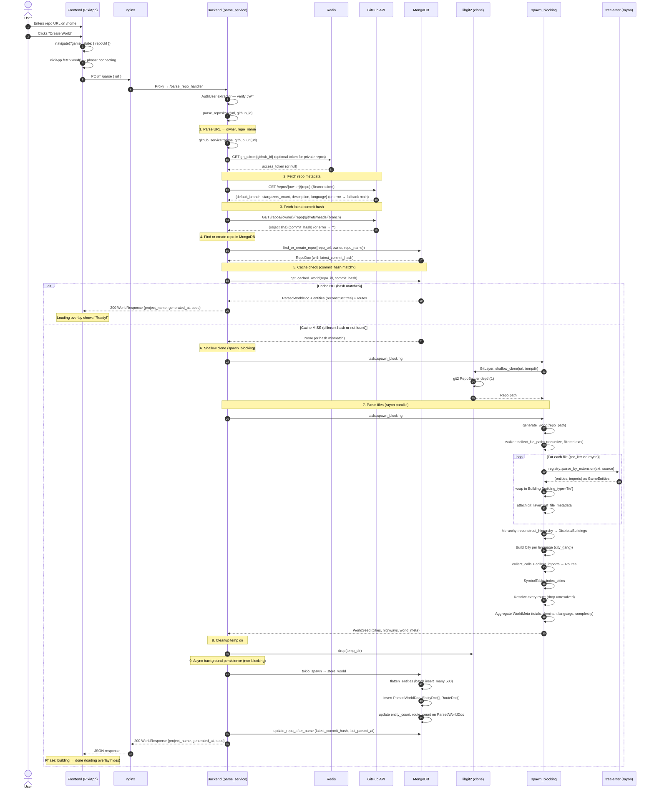
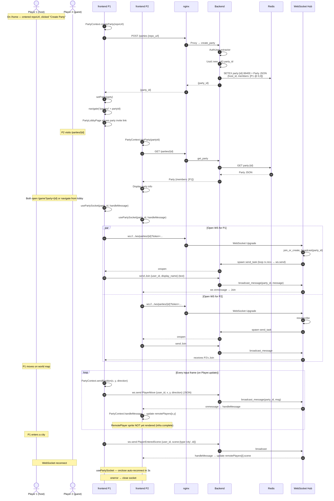
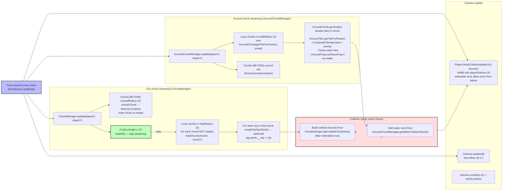

# NilsBohr — Data Flow Diagrams

Detailed mermaid sequence and flow diagrams showing how data moves through the system for each major user journey.

---

## Table of Contents

1. [GitHub OAuth Login Flow](#1-github-oauth-login-flow)
2. [Repo Parsing Pipeline](#2-repo-parsing-pipeline)
3. [Game Loading Flow](#3-game-loading-flow)
4. [Multiplayer Party Flow](#4-multiplayer-party-flow)
5. [Scene Navigation Flow](#5-scene-navigation-flow)
6. [Chunk Streaming Flow](#6-chunk-streaming-flow)
7. [Ground Rendering Pipeline](#7-ground-rendering-pipeline)
8. [Repo → World Transformation](#8-repo--world-transformation)

---

## 1. GitHub OAuth Login Flow

The complete GitHub OAuth flow. The user starts on the landing page, gets redirected to GitHub, authorizes, then returns with a JWT token stored in localStorage.

```mermaid
sequenceDiagram
    autonumber
    actor U as User Browser
    participant FE as Frontend (React)
    participant NG as nginx :8080
    participant BE as Backend (Axum) :5000
    participant GH as GitHub OAuth
    participant RD as Redis
    participant MY as MySQL

    U->>FE: Opens http://100.90.255.62:8080
    FE->>FE: AuthProvider loads token from localStorage
    FE->>FE: No token → show LandingPage

    U->>FE: Click "Sign in with GitHub"
    FE->>FE: AuthContext.login('github')
    FE-->>U: window.location.href = VITE_BACKEND_URL + '/auth/login'
    U->>NG: GET /auth/login
    NG->>BE: Proxy → /auth/login

    BE->>BE: login handler → build_login_url
    BE->>BE: build_authorize_url (frontend_url, gh_client_id)
    BE-->>NG: 302 → https://github.com/login/oauth/authorize?client_id=...&redirect_uri={frontend}/auth/callback&scope=read:user user:email
    NG-->>U: 302 redirect to GitHub
    U->>GH: GET /login/oauth/authorize (authorize app)

    GH->>U: Show "Authorize nilsbohr" page
    U->>GH: Click "Authorize"
    GH-->>U: 302 → http://100.90.255.62:8080/auth/callback?code=... (registered callback)
    U->>NG: GET /auth/callback?code=...
    NG->>BE: Proxy → /auth/callback?code=...

    BE->>BE: callback handler — reads code (or error)
    BE->>GH: POST /login/oauth/access_token {client_id, client_secret, code}
    GH-->>BE: {access_token, token_type}
    BE->>GH: GET /user (Bearer token, User-Agent: nilsbohr-backend)
    GH-->>BE: {id, login, name?, email?, avatar_url?}

    BE->>MY: find_or_create_oauth_user(provider='github', provider_user_id=gh.id)
    MY-->>BE: UserRow (existing → UPDATE last_login_at, NEW → INSERT users + oauth_identities)

    BE->>RD: SET user:{github_id} = User JSON
    BE->>RD: SET gh_token:{github_id} = access_token
    BE->>RD: SETEX session:{uuid} 604800 = github_id
    BE->>BE: jwt::create_token({sub=github_id, username, session_id, exp})

    BE-->>NG: 302 + Set-Cookie: token=...; HttpOnly; SameSite=Lax Path=/
            + Location: {frontend_url}/login/callback?token={jwt}
    NG-->>U: 302 → /login/callback?token=eyJ...
    U->>NG: GET /login/callback?token=...
    NG->>FE: Try files $uri /index.html → CallbackPage (React SPA)

    FE->>FE: CallbackPage — read ?token from URL
    FE->>NG: GET /auth/me (Authorization: Bearer token)
    NG->>BE: Proxy → /auth/me
    BE->>BE: AuthUser extractor — verify JWT, check Redis session
    BE->>RD: GET user:{github_id}
    RD-->>BE: User JSON
    BE-->>NG: {github_id, username, display_name, avatar_url, email}
    NG-->>FE: 200 + user

    FE->>FE: localStorage.setItem('token', jwt)
    FE->>FE: localStorage.setItem('github_id', github_id)
    FE->>FE: localStorage.setItem('username', username)
    FE-->>U: window.location.href = '/home'
    U->>FE: Navigates to /home (ProtectedRoute → Home component)
```

### Key things to note

- **Same-origin**: All requests go through nginx at port 8080, avoiding CORS issues for browser-initiated requests.
- **Cookie vs Header**: The backend sets an HTTP-only `token` cookie AND redirects with `?token=...` as a query param. The frontend stores the token in `localStorage` (since HttpOnly cookies can't be read by JS, the redirect URL provides it).
- **Two callback paths**:
  - `/auth/callback` (backend, called by GitHub directly) → exchanges code for token, redirects with token to...
  - `/login/callback` (frontend, handled by `CallbackPage`) → stores token + fetches user info
  - nginx routes `/auth/*` to backend and `/login/callback` to frontend (because `/login/` matches `/`)
- **Session TTL**: 7 days (`SESSION_TTL_SECS = 7 * 24 * 60 * 60`). JWT `exp` matches.

---

## 2. Repo Parsing Pipeline

The complete repo → game-world pipeline. Triggered when the user enters a GitHub repo URL and the frontend calls `POST /parse`.



### Cache strategy

The world cache is **content-addressed** by `latest_commit_hash`:
- Same commit hash → instant MongoDB lookup, no reclone/reparse
- Different/new commit → full reclone + reparse, then **async** persisted (does NOT block the response)

This means re-parsing the same repo at the same commit is essentially free after the first parse.

### Supported languages

| Language | Tree-sitter grammar | `language_registry!` extension |
|---|---|---|
| Rust | tree-sitter-rust | `.rs` |
| TypeScript | tree-sitter-typescript | `.ts`, `.tsx` |
| JavaScript | tree-sitter-javascript | `.js`, `.jsx` |
| Python | tree-sitter-python | `.py` |
| C++ | tree-sitter-cpp | `.cpp`, `.cc`, `.cxx`, `.hpp` |
| C | tree-sitter-c | `.c`, `.h` |
| Java | tree-sitter-java | `.java` |

Skipped directories: `node_modules`, `target`, `dist`, `build`, `__pycache__`, `.git`, `vendor`.

---

## 3. Game Loading Flow

The `PixiApp` component's lifecycle from mount to playable game. Handles two loading paths: real backend parse or bundled sample data fallback.

```mermaid
flowchart TD
    Start["User navigates to /game<br/>(redirect from /home with location.state.repoUrl OR direct visit)"]

    subgraph Guards["Guard chain"]
        DG["DeviceGuard<br/>(touch-only device check)"]
        AP["AuthProvider<br/>(load token, fetch /auth/me)"]
        PR["ProtectedRoute<br/>(must be authenticated)"]
        PP["PartyProvider<br/>(creates WebSocket)"]
        BG["BackendGuard<br/>(polls /health every 5s)"]
    end

    Start --> DG
    DG -->|"OK: has keyboard"| AP
    AP --> PR
    PR -->|"authenticated"| PP
    PP --> BG
    BG -->|"offline"| RetryScreen["BackendOffline screen<br/>(Retry Now / auto-retry 5s)"]
    BG -->|"online"| PixiMount["PixiApp mounts"]

    PixiMount --> CheckState{"location.state.repoUrl<br/>present?"}

    subgraph Online["Online path (with repoUrl)"]
        Phase1["Phase: connecting<br/>progress=0%<br/>wait 300ms"]
        Phase2["Phase: parsing<br/>progress=5%"]
        API["POST /parse {url}<br/>with onDownloadProgress"]
        Phase3["Phase: downloading<br/>progress=10-90%<br/>(from total bytes)"]
        Phase4["Phase: building<br/>progress=92%<br/>wait 400ms"]
    end

    subgraph Offline["Offline path (no repoUrl)"]
        Phase50["Phase: building<br/>progress=50%<br/>wait 200ms"]
        Sample["Use bundled sample.json"]
    end

    CheckState -->|"yes"| Phase1
    Phase1 --> Phase2
    Phase2 --> API
    API -->|"streaming data"| Phase3
    Phase3 --> Phase4
    API -->|"error"| ErrScreen["Error screen<br/>'Failed to load world'<br/>Back to Home btn"]
    CheckState -->|"no"| Phase50
    Phase50 --> Sample

    Phase4 --> PhaseDone["Phase: done<br/>progress=100%<br/>wait 500ms"]
    Sample --> PhaseDone

    PhaseDone --> SeedState["setSeed(seed)"]

    subgraph Engine["Engine lifecycle"]
        RootRef["pixiContainer ref ready"]
        SM["new SceneManager(root)<br/>(once + singleton)"]
        WorldScene["new WorldScene(seed, manager)<br/>switched in"]
        Mount["WorldScene.mount()<br/><br/>1. WorldGenerator from project meta<br/>2. Generate city layout<br/>3. Compute world bounds<br/>4. ChunkManager (loadRadius 5)<br/>5. Player spawn<br/>6. GroundTiles + GroundProps<br/>7. GroundChunkManager<br/>8. WorldMiniMap<br/>9. Camera follow player"]
    end

    SeedState --> RootRef
    RootRef --> SM
    SM --> WorldScene
    WorldScene --> Mount

    Mount --> Playable["Game running<br/>Ticker.shared drives<br/>scene.update(dt) every frame"]
    Playable --> HomeBtn["🏠 Home button overlay visible"]

    style DG fill:#fcf,stroke:#333,stroke-width:2px
    style BG fill:#fcf,stroke:#333,stroke-width:2px
    style ErrScreen fill:#fbb,stroke:#333,stroke-width:2px
    style Playable fill:#bfb,stroke:#333,stroke-width:2px
```



### Phase UI components (PixiApp.tsx)

| Phase | Label | Progress range |
|---|---|---|
| `connecting` | "Connecting to server…" | 0% |
| `parsing` | "Parsing repository…" | 5% |
| `downloading` | "Downloading world seed…" | 10-90% (from `onDownloadProgress`) |
| `building` | "Building world…" | 92-100% |
| `done` | "Ready!" | 100% |

The loading overlay is a pixel-art themed card with an animated progress bar and shimmer effect (defined in `PixiApp.css`).

---

## 4. Multiplayer Party Flow

The party creation → WebSocket connection → real-time message relay flow. Note: there is **no server-side Join/Leave synthesis** — messages are broadcast as-is to all subscribers. Also, presence/membership is not mutated by the WebSocket handler; only `create_party` seeds the initial member.



### PartyMessage wire format (TypeScript union)

Defined in `frontend/types/PartyTypes.ts` (mirroring the backend's `multiplayer/messages.rs`):

```ts
type PartyMessage =
  | { type: 'Join';          user_id: number; display_name: string }
  | { type: 'Leave';         user_id: number }
  | { type: 'PlayerMove';    user_id: number; x: number; y: number; direction: string }
  | { type: 'PlayerEnteredScene'; user_id: number; scene: SceneRef }
  | { type: 'PartyState';    members: PartyMember[] }

type SceneRef = { type: 'world' | 'city' | 'building' | 'room'; id: string }
```

### Current limitations

- **No server-side `Join`/`Leave` synthesis** — clients send these messages themselves.
- **No auth on WS handler** — any client knowing the `party_id` can connect.
- **Single-instance broadcast**: The `BROADCASTS` map is `Lazy<Mutex<HashMap>>` inside the backend process. Multiple backend instances would NOT share broadcast channels — would require Redis Pub/Sub.
- **Remote players not yet rendered**: `PartyContext` tracks `remotePlayers` and `RemotePlayer.tsx` exists, but no scene currently renders these sprites or calls `sendPosition`. Multiplayer infrastructure is in place but gameplay integration is incomplete.

---

## 5. Scene Navigation Flow

The four-scene hierarchy navigated by J (enter) and Escape (go back). Each scene preserves entry positions to allow returning. `worldSeed` and `worldEntryPosition` are threaded throughout so Escape at any level can return to the overworld.

```mermaid
stateDiagram-v2
    [*] --> WorldScene : SceneManager.switch(new WorldScene(seed))

    WorldScene --> CityScene : Press J near city<br/>(proximity check)<br/>pass: worldEntryPos, seed, city

    CityScene --> BuildingScene : Press J near building entry zone<br/>(bottom of building within 10-50px)<br/>pass: entryPos, building, city, seed, world context

    BuildingScene --> RoomScene : Press J near room<br/>pass: buildingPos, entryPos, room, building, city, world context

    RoomScene --> BuildingScene : Press Escape<br/>(deepest level — no entry from rooms)
    BuildingScene --> CityScene : Press Escape
    CityScene --> WorldScene : Press Escape<br/>(lazy dynamic import to avoid circular dep)
    WorldScene --> [*] : scene.unmount()<br/>(navigate / or component unmount)

    note right of WorldScene : Layers:<br/>groundLayer, cityLayer, entityLayer<br/>ChunkManager (loadRadius 5)<br/>GroundChunkManager (loadRadius 2)<br/>WorldMiniMap (top-right)

    note right of CityScene : Uses:<br/>CityGenerator (organic strategy)<br/>BiomeConfig (6 biomes)<br/>RoadNetwork (Kruskal MST + nearest-neighbor streets)<br/>CityGroundRenderer<br/>Minimap (top-right, districts)

    note right of BuildingScene : Renders:<br/>Header "📁 {building.name}"<br/>Info line: type | LOC | rooms<br/>Rooms (grid layout) OR direct artifacts<br/>Floor 0x1a1a2e with 50px grid

    note right of RoomScene : Renders:<br/>Room icon (getRoomIcon)<br/>Badges: is_async, is_main, visibility<br/>Two-line metadata + params → return type<br/>Artifacts (force-directed layout)
```

### Scene implementation pattern

Each scene defines a `Scene` interface (defined in `types/Types.ts:10-15`):

```ts
interface Scene {
  container: Container;   // PixiJS Container added to stage
  mount(): Promise<void>; // Setup (load sprites, build visuals)
  update(dt: number): void; // Called every frame by SceneManager
  unmount(): void; // Teardown
}
```

### Circular dependency handling

`WorldScene.ts` statically imports `CityScene.tsx`, but `CityScene.tsx` ALSO imports `WorldScene` (for Escape transition). To break the cycle, `CityScene` uses a **dynamic import** inside its ESC handler:

```ts
// CityScene.tsx ESC handler
const { WorldScene } = await import('./WorldScene')
this.manager.switch(new WorldScene(seed, manager))
```

This defers the import until runtime, avoiding the static import cycle.

---

## 6. Chunk Streaming Flow

There are two independent chunk systems running simultaneously in `WorldScene`:
1. **City chunks** (`ChunkManager`, chunkSize 1000, loadRadius 5) — for loading/unloading city sprites as the player explores.
2. **Ground chunks** (`GroundChunkManager`, chunkSize 512, loadRadius 2) — for rendering the terrain tiles and water collision rects.

Both follow the player's position. There's a small-world optimization: worlds with ≤15 cities skip chunk loading entirely (`loadAll()`).



### Auto-tile water detection

`GroundTiles.getTileForPosition(x, y)` runs on every chunked tile:
1. Look up the 4 cardinal neighbors' terrain types.
2. Find the lowest-priority neighbor (water=0, sand=1, grass=2, stone=3).
3. Compute which neighbors match the lowest priority → pick the appropriate edge/corner variant.
4. Return `(base_tile, overlay_tile)` for the tilemap.

Water regions are tracked by `GroundChunk` (line 86-91 of `GroundChunk.ts`) so `GroundChunkManager.getWaterCollisionRects()` can feed them to `WorldScene` for collision blocking.

---

## 7. Ground Rendering Pipeline

The procedural ground system creates an island world with value-noise terrain, auto-tiled edges between biomes, and biome-aware decorative props. Determinism is critical — same seed always produces the same world.

```mermaid
flowchart TD
    Seed["Seed string<br/>(project name + generated_at)"]

    subgraph TerrainGen["Terrain.ts — Value noise heightmap"]
        Hash["hash(x, y) — DJB2-style"]
        FBm["fbm() — 5 octaves<br/>freq ×2, amp ×0.5"]
        GetHeight["getHeight(x, y)<br/>continent (0.6) + hills (2×, 0.4) + detail (6×, 0.15)<br/>cached per coord"]
        Island["getIslandMask(x, y)<br/>smoothstep(0.7, 1.0) of<br/>radial distance from world center"]
    end

    subgraph GroundTilesSys["GroundTiles — Auto-tile system"]
        GetTerrain["getTerrainType(x, y)<br/>height < 0.30 → water<br/>height < 0.42 → sand<br/>height > 0.75 → stone<br/>else → grass<br/>(also gated by island mask)"]
        Neighbors["getTileForPosition(x, y)<br/>check 4 neighbors of current terrain<br/>find lowest-priority neighbor<br/>pick base + corner/edge/full overlay"]
        Tilemap["CompositeTilemap<br/>(base + overlay on layer)"]
    end

    subgraph PropsSys["GroundProps — Decorative placement"]
        MultiNoise["multi-noise sampling:<br/>• density (scale 0.07)<br/>• cluster (scale 0.02)<br/>• biome (scale 0.002)<br/>• subBiome (scale 0.006)"]
        Field["placement field gate:<br/>f = densityNoise × density<br/>must be ≥ threshold (0.55)"]
        BiomeMod["biome modifiers:<br/>plains (× 0.7), mixed (×1.0),<br/>forest (×1.6)"]
        PickProp["pickProp(weights by biome):<br/>smallTree / mediumTree / bigTree<br/>rock / bigRock / aquaRock<br/>bush / flower1 / lilac / ..."]
        MinDist["min-distance check<br/>against placedProps list"]
        ZIndex["zIndex = worldY<br/>(depth sorting)"]
    end

    subgraph ChunkM["GroundChunkManager — Chunk lifecycle"]
        Update["update(playerX, playerY)"]
        Load["For each chunk in loadRadius: create<br/>new GroundChunk(getTileForPosition, props)"]
        ChunkGen["GroundChunk.generate():<br/>for tile in chunk bounds:<br/>  base + overlay on tilemap<br/>  if water → track for collision<br/>  if not water + propsEnabled:<br/>    GroundProps.tryPlaceProp(...)"]
        Unload["Chunks beyond current set:<br/>destroyContainer"]
    end

    Seed --> Hash
    Hash --> FBm
    FBm --> GetHeight
    GetHeight --> GetTerrain
    GetHeight --> Island
    Island --> GetTerrain

    GetTerrain --> Neighbors
    Neighbors --> Tilemap

    Seed --> MultiNoise
    MultiNoise --> Field
    Field --> BiomeMod
    BiomeMod --> PickProp
    PickProp --> MinDist
    MinDist --> ZIndex

    Update --> Load
    Load --> ChunkGen
    ChunkGen --> Tilemap
    ChunkGen --> "place props" --> ZIndex
    Update --> Unload

    subgraph Output["Final output"]
        Visual["Rendered scene"]
        Collision["waterCollisionRects[]<br/>(fed into Player.checkCollision)"]
    end

    Tilemap --> Visual
    ZIndex --> Visual
    ChunkGen -->|"water tiles tracked"| Collision

    style Seed fill:#fcf,stroke:#333,stroke-width:2px
    style FBm fill:#bbf,stroke:#333,stroke-width:2px
    style ChunkGen fill:#bfb,stroke:#333,stroke-width:2px
    style Collision fill:#fdd,stroke:#333,stroke-width:2px
```

### Two RNG systems

- **SeededRandom (Mulberry32)** — used by WorldGenerator, CityGenerator, CityLayout, ArtifactSprite layout, RoadNetwork generation. Spatial hashing via `at(x, y)` returns the same value regardless of exploration order.
- **GroundGraphics local random** (`GroundProps.seededRandom` at line 337) — separate from `SeededRandom`. `Terrain.ts` uses pure value-noise (no PRNG state). Both systems are deterministic per coordinate.

---

## 8. Repo → World Transformation

How a GitHub repository becomes a navigable game world. The code metaphor mapping is rigid: each language becomes a City, each folder becomes a District, each struct/class becomes a Building, each function becomes a Room, and each variable/constant becomes an Artifact.

```mermaid
flowchart TD
    RepoURL["GitHub repo URL<br/>(e.g. github.com/user/repo)"]

    subgraph Clone["Step 1: Clone (git_layer.rs)"]
        Shallow["shallow_clone (depth=1)<br/>via libgit2 RepoBuilder"]
        TipMeta["get_tip_metadata:<br/>author, last_commit_message,<br/>last_modified, commit_hash"]
    end

    subgraph Walk["Step 2: Walk files (walker.rs)"]
        Recurse["recursive collect_file_paths<br/>filter by extension:<br/>{rs, ts, tsx, js, jsx, py,<br/>cpp, cc, cxx, hpp, c, h, java}"]
        Skip["SKIP directories:<br/>{node_modules, target, dist,<br/>build, __pycache__, .git, vendor}"]
    end

    subgraph Parse["Step 3: Parse in parallel (rayon)"]
        ParIter["par_iter().filter_map(parse_single_file)"]
        PerFile["per file:<br/>- read source (LOC = lines.count())<br/>- registry::parse_by_extension(ext, source)<br/>- → returns (entities, imports)<br/>- wrap in Building {building_type='file'}<br/>- attach git metadata"]
        Languages["7 tree-sitter parsers:<br/>RustParser (use_decl, struct, function...)<br/>TypeScriptParser (import, class, function...)<br/>JavaScriptParser (mirrors TS)<br/>PythonParser (class, def, decorator...)<br/>CppParser / CParser / JavaParser"]
    end

    subgraph HierarchyBuild["Step 4: Build hierarchy (hierarchy.rs)"]
        DirTree["reconstruct_hierarchy<br/>split path by '/'<br/>build DirNode tree"]
        EmitDistrict["Emit GameEntity::District<br/>{id: 'district_{path}',<br/> path, children}"]
        EmitBuilding["embed Building entities<br/>inside Districts"]
    end

    subgraph Cities["Step 5: Build Cities (parser.rs)"]
        ByLang["Group ParsedFile by normalized language"]
        PerLang["per language:<br/>hierarchy::reconstruct_hierarchy(files)<br/>find_entry_point (Room.is_main)<br/>count stats (bldg/room/artifact/loc)<br/>assign theme (rust→industrial,<br/>ts→neon, py→nature, ...)"]
        EmitCity["Emit GameEntity::City<br/>{id: 'city_{lang}',<br/> language, theme, entry_point_id,<br/> stats, children: [Districts]}"]
    end

    subgraph RoutesR["Step 6: Build Routes"]
        Calls["GameEntity::collect_calls()<br/>recurse Rooms → (from_id, to_id)<br/>emit Route { route_type: 'FunctionCall' }"]
        Imports["GameEntity::collect_imports()<br/>recurse Buildings → (from_id, to_id)<br/>emit Route { route_type: 'Import' }"]
        SymTab["SymbolTable::index_cities()<br/>symbols: id→id exact<br/>index: short_name → [ids]<br/>resolve(to_id, from_id):<br/> 1. exact id match<br/> 2. {file_id}::{symbol}<br/> 3. short-name index + longest common prefix"]
        Keep["Keep only resolved routes"]
    end

    subgraph Meta["Step 7: Aggregate WorldMeta"]
        ComputeCounts["total_cities, total_buildings<br/>total_rooms, total_artifacts"]
        DominantLang["dominant_language<br/>= max city by LOC"]
        Complexity["complexity_score<br/>(depth × branching × max-children)"]
    end

    subgraph Save["Step 8: Persist (async, non-blocking)"]
        FlattenT["flatten_entities (domain/entity_tree.rs)<br/>walk tree, write stripped EntityDocs<br/>with sort_order"]
        Batch["insert ParsedWorldDoc<br/>insert_many(500) per batch<br/>insert RouteDoc[]"]
        UpdateRepo["update_repo_after_parse<br/>(latest_commit_hash, last_parsed_at)"]
    end

    subgraph Frontend["Step 9: Render (PixiJS)"]
        SeedReceive["Frontend receives WorldSeed<br/>{cities, highways, world_meta}"]
        WorldGen["WorldGenerator<br/>golden-angle spiral city layout<br/>resolve collisions (10 iters)"]
        SpawnPlayer["Spawn player at world center"]
        PerCity["Each City → CitySprite<br/>radius from LOC<br/>language-colored border"]
        EnterCity["Player walks into City → CityScene"]
        PerBuilding["Each Building → BuildingSprite<br/>biome-themed, empty red-dashed"]
        EnterBuilding["Player walks into Building → BuildingScene"]
        PerRoom["Each Room → RoomSprite<br/>colored by room_type<br/>async/main badges"]
        ReadMetadata["Player reads header info:<br/>type, LOC, params, return type,<br/>complexity, documentation"]
    end

    RepoURL --> Shallow
    Shallow --> TipMeta
    Shallow --> Recurse
    Recurse --> Skip
    Recurse --> ParIter
    ParIter --> PerFile
    PerFile --> Languages
    PerFile --> DirTree
    DirTree --> EmitDistrict
    EmitDistrict --> EmitBuilding
    EmitBuilding --> ByLang
    ByLang --> PerLang
    PerLang --> EmitCity
    EmitCity --> Calls
    EmitBuilding --> Imports
    Calls --> SymTab
    Imports --> SymTab
    SymTab --> Keep
    Keep --> Meta
    EmitCity --> ComputeCounts
    ComputeCounts --> DominantLang
    DominantLang --> Complexity

    Keep --> FlattenT
    EmitCity --> FlattenT
    FlattenT --> Batch
    Batch --> UpdateRepo

    EmitCity --> SeedReceive
    Keep --> SeedReceive
    Meta --> SeedReceive
    SeedReceive --> WorldGen
    WorldGen --> SpawnPlayer
    SpawnPlayer --> PerCity
    PerCity --> EnterCity
    EnterCity --> PerBuilding
    PerBuilding --> EnterBuilding
    EnterBuilding --> PerRoom
    PerRoom --> ReadMetadata

    style Shallow fill:#fbb,stroke:#333,stroke-width:2px
    style WorldGen fill:#bbf,stroke:#333,stroke-width:2px
    style ReadMetadata fill:#bfb,stroke:#333,stroke-width:2px
```



### Code metaphor mapping

| Code element | Game element | GameEntity variant | Visual |
|---|---|---|---|
| Language (Rust, TS, ...) | **City** | `City` | Colored square, language-themed |
| Folder / directory | **District** | `District` | Bordered region on city map |
| File (per language) | **Building** | `Building` (type='file') | Biome-themed building |
| Struct / class / interface | **Building** (child) | `Building` | Smaller themed building |
| Function / method | **Room** | `Room` | Colored square, async/main badges |
| Variable / const / field | **Artifact** | `Artifact` | Panel with icon + datatype |
| Function call | **Highway/Route** | `Route` (FunctionCall) | Visual path between rooms |
| Import | **Highway/Route** | `Route` (Import) | Visual path between buildings |

### Themes by language (parser.rs:162-188)

| Language | Theme name | Theme prefix |
|---|---|---|
| Rust | "Industrial" | "Rustopolis" |
| TypeScript | "Neon" | "Typescriptia" |
| JavaScript | "Neon" | "Javascriptica" |
| Python | "Nature" | "Pythonesia" |
| C++ | "Industrial" | "Cpptropolis" |
| C | "Industrial" | "C City" |
| Java | "Tech" | "Javapolis" |
| (unrecognized) | (based on extension) | (default) |